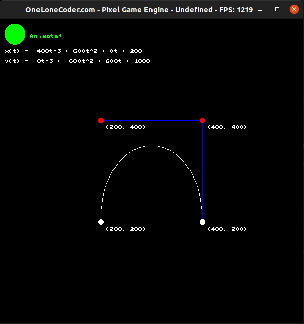
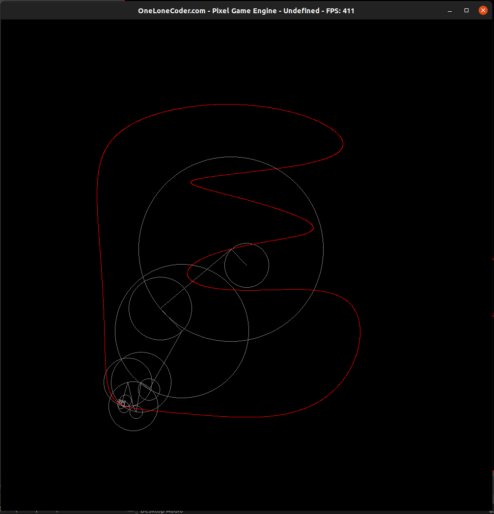
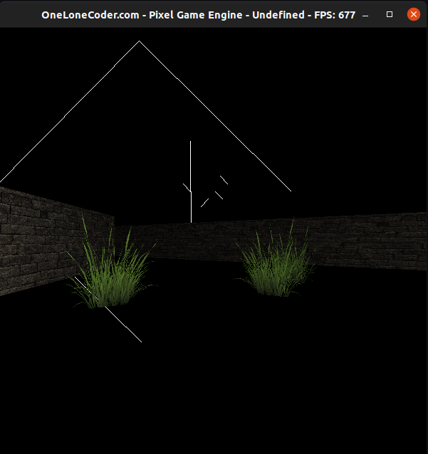
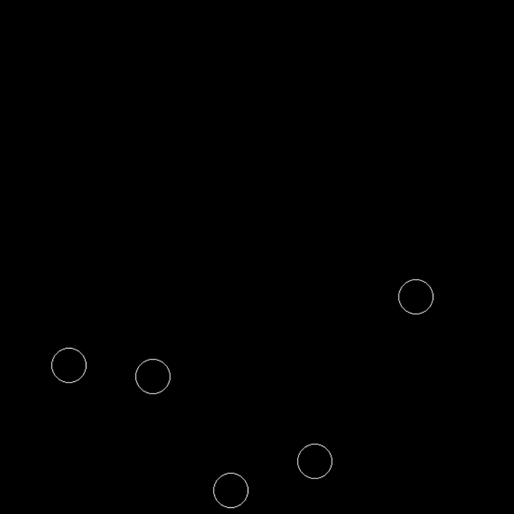

# cppProjs

A collection of projects I made in an effort to learn some C++ through the later part of 2020.
Below is a demonstration of some of the notable projects.

These mostly made use of [One Lone Coder's Pixel Game Engine](https://github.com/OneLoneCoder/olcPixelGameEngine) for the game-loop and rendering stuff.

# Bezier Curves

When learning about Bezier curves in our year 12 Specialist Mathematics class I made this to visualise how these curves are constructed.

# Fourier Series' / Epicycles

Inspired by the [3Blue1Brown video](https://www.youtube.com/watch?v=r6sGWTCMz2k&t=1213s&ab_channel=3Blue1Brown), the user can draw a simple closed shape and the program will attempt to recreate it with a collection of rotating circles.

# 2.5D Renderer

This is a software renderer to draw pseudo-3D environments in a Doom sort of style. The world is constructed of lines in 2D like a map, and is rendered with ray-casts from the player position to those lines and drawn to the screen. They can even be textured!

# Discord Sweeper

An extremely basic program which generates a Minesweeper field and prints it out in a format such that it will be displayed in a playable format when pasted into Discord

# Bouncing Balls (Balls)

Just some circles that bounce around like balls, pulled the logic from my year 11 school project [FooBall](https://github.com/Googe14/FooBall)

